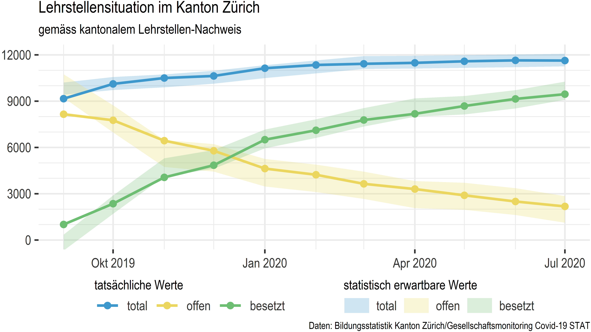

# Gesellschaftsmonitoring COVID19, Daten Bildungsstatistik

Daten der Bildungsstatistik im Rahmen des Projekts [Gesellschaftsmonitoring COVID19](https://statistikzh.github.io/covid19monitoring/)

## Datenlieferant

Kanton Zürich, Bildungsstatistik

## Beteiligte

Flavian Imlig <flavian.imlig@bi.zh.ch>, Bildungsdirektion, Bildungsplanung

## Datenbestände

### Anzahl abgeschlossener Lehrverträge pro Monat

https://pub.bista.zh.ch/de/zahlen-und-fakten/andere/lehrvertraege/

Der Indikator beschreibt die Anzahl der monatlich erfassten Lehrverträge mit Lehrvertragsbeginn im gleichen Kalenderjahr. Die Anzahl ist ein Nettowert, da auch Lehrvertragsauflösungen erfasst sind.

Die Lehrverträge werden anhand des sogenannten Erfassungsdatums den Monaten zugeordnet, also dem Datum an dem sie durch das Mittelschul- und Berufsbildungsamt (MBA) erfasst werden. Dabei ist zu berücksichtigen, dass die Betriebe selber bestimmen in welchem Rhythmus sie ihre Lehrverträge dem MBA zur Erfassung übermitteln.

Die bereits im Vorjahr abgeschlossenen Lehrverträge werden jeweils dem Januar des Kalenderjahres, in dem der Lehrvertragsbeginn liegt, zugeordnet. Die Anzahl der Lehrverträge ist deshalb im Januar besonders hoch.

In den Vorjahren bestand jeweils ein Rückstand bei der Erfassung von Lehrverträgen durch das MBA. Dies ist in der aktuellen Situation 2020 kaum der Fall.

### offene Lehrstellen

https://pub.bista.zh.ch/de/zahlen-und-fakten/andere/lehrstellen/

Der Indikator beschreibt die Anzahl ausgeschriebener und noch offener Lehrstellen mit Lehrvertragsbeginn im kommenden Schuljahr.

Erfasst werden die Lehrstellen im kantonalen Lehrstellen-Nachweis [LENA](https://www.berufsberatung.ch/dyn/show/2930). Die Erfassung der Lehrstellen erfolgt jeweils per Ende Monat.

Erfasst werden nur Lehrstellen mit Lehrbeginn im jeweils kommenden August. Eine Jahreszeitreihe umfasst September bis Juli. Da im August die Umstellung auf das neue Lehrjahr erfolgt, sind die Lehrstellen nicht immer eindeutig einem Lehrjahr zuzuordnen. Die Daten des Monats August werden deshalb nicht ausgewiesen.

### besetzte Lehrstellen

https://pub.bista.zh.ch/de/zahlen-und-fakten/andere/lehrstellen/

Der Indikator beschreibt die Anzahl Lehrstellen mit Lehrvertragsbeginn im kommenden Schuljahr, die ausgeschrieben und besetzt sind.

Datenbasis ist ebenfalls der kantonale Lehrstellen-Nachweis [LENA](https://www.berufsberatung.ch/dyn/show/2930). Die Erfassung der Lehrstellen erfolgt jeweils per Ende Monat.

## Auswertungen

Es wurde allgemein erwartet, dass sich die Massnahmen, die der Bundesrat als Reaktion auf die sogenannte Corona-Krise definiert hat, unter anderem auf die Lehrstellensituation auswirken. Die Daten aus dem kantonalen Lehrstellen-Nachweis ermöglichen eine Überprüfung dieser Vermutung für den Kanton Zürich.

Insgesamt waren im Schuljahr 2019/20 bezüglich der besetzten und offenen Lehrstellen keine massiven Abweichungen gegenüber den Vorjahren zu verzeichnen.

Die statistisch erwartbaren Werte werden mittels eines Prognosemodells auf der Basis der Daten seit 2013 berechnet. Zum Einsatz kommt die Methode von Holt-Winters mit additiver Saison und den Parametern $\alpha = 0.8$, $\beta = 0$ und $\gamma = 0.1$. Dargestellt sind die Werte des $95\%$-Konfidenzintervalls.
